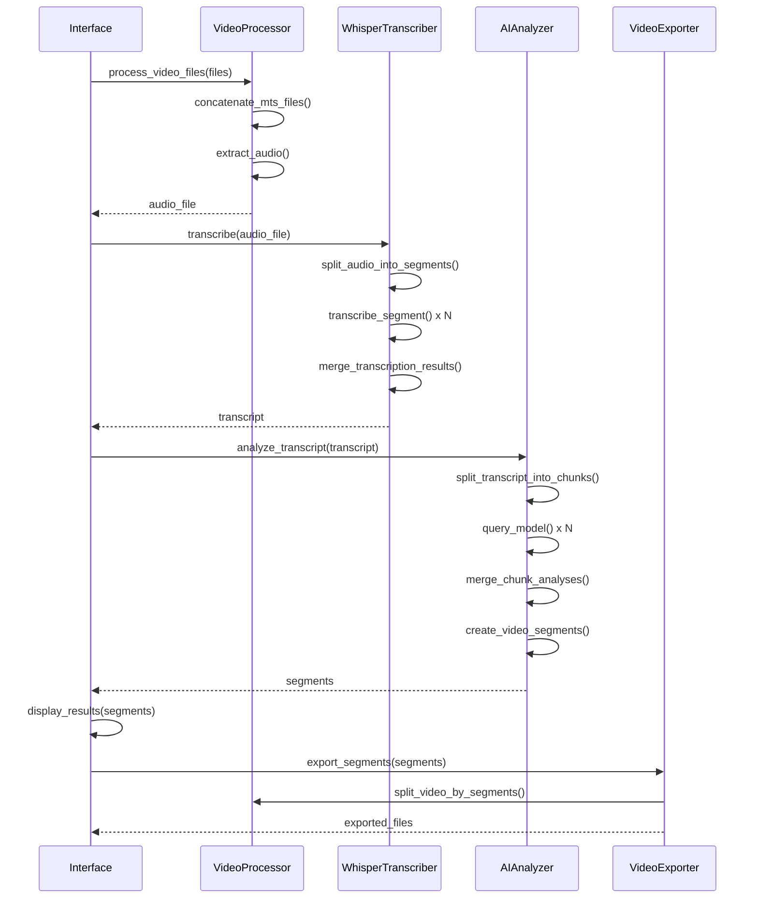

# Documentation Technique - Découpeur Vidéo Intelligent

## 📋 Table des matières

1. [Architecture générale](#architecture-générale)
2. [Stack technique](#stack-technique)
3. [Modules détaillés](#modules-détaillés)
4. [Flux de traitement](#flux-de-traitement)
5. [Configuration](#configuration)
6. [APIs et interfaces](#apis-et-interfaces)
7. [Tests et qualité](#tests-et-qualité)
8. [Déploiement](#déploiement)
9. [Maintenance](#maintenance)

## Architecture générale

### Vue d'ensemble

```
┌─────────────────────────────────────────────────────────────┐
│                    Interface Utilisateur                    │
│                      (PyQt5 GUI)                           │
├─────────────────┬─────────────────┬─────────────────────────┤
│  Sélection      │   Progression   │      Résultats         │
│  Fichiers       │   Traitement    │      Validation        │
└─────────────────┴─────────────────┴─────────────────────────┘
                           │
                           ▼
┌─────────────────────────────────────────────────────────────┐
│                   Couche Métier                            │
├─────────────────┬─────────────────┬─────────────────────────┤
│  Video          │  Transcription  │      AI Analysis       │
│  Processing     │     (Whisper)   │       (Ollama)         │
└─────────────────┴─────────────────┴─────────────────────────┘
                           │
                           ▼
┌─────────────────────────────────────────────────────────────┐
│                 Couche Infrastructure                       │
├─────────────────┬─────────────────┬─────────────────────────┤
│    FFmpeg       │    File I/O     │       Logging          │
│   (Binaire)     │   Management    │      & Config          │
└─────────────────┴─────────────────┴─────────────────────────┘
```

### Patterns architecturaux

- **MVP (Model-View-Presenter)** : Séparation claire entre UI et logique métier
- **Factory Pattern** : Création des processeurs vidéo selon les formats
- **Observer Pattern** : Communication via signaux Qt pour les mises à jour de progression
- **Strategy Pattern** : Choix des modèles IA selon la configuration
- **Singleton** : Gestionnaire de configuration global

## Stack technique

### Langages et frameworks
- **Python 3.8+** : Langage principal
- **PyQt5 5.15+** : Interface graphique native
- **FFmpeg** : Traitement vidéo/audio (binaire externe)
- **OpenAI Whisper** : Transcription audio → texte
- **Ollama** : Modèles LLM locaux pour analyse
- **PyInstaller** : Packaging en exécutable standalone

### Dépendances principales

```python
# Interface et système
PyQt5>=5.15.10          # Interface graphique
PyInstaller>=5.0        # Packaging

# Traitement multimédia
ffmpeg-python==0.2.0    # Wrapper FFmpeg Python
librosa==0.10.1         # Analyse audio
pydub==0.25.1           # Manipulation audio

# Intelligence artificielle
openai-whisper==20231117 # Transcription
torch>=2.1.0            # Backend ML pour Whisper
ollama==0.1.8           # Client Ollama

# Utilitaires
numpy>=1.24.3           # Calculs numériques
Pillow>=10.0.1          # Traitement d'images
requests>=2.31.0        # Requêtes HTTP
python-dateutil>=2.8.2 # Manipulation dates
```

### Architecture des fichiers

```
src/
├── main.py                    # Point d'entrée principal
├── config.py                  # Configuration globale
│
├── ui/                        # Interface utilisateur
│   ├── __init__.py
│   ├── main_window.py         # Fenêtre principale
│   └── segment_editor.py      # Éditeur de segments
│
├── video/                     # Traitement vidéo
│   ├── __init__.py
│   └── processor.py           # Wrapper FFmpeg
│
├── transcription/             # Transcription audio
│   ├── __init__.py
│   └── whisper_transcriber.py # Interface Whisper
│
├── ai_analysis/              # Analyse IA
│   ├── __init__.py
│   └── analyzer.py           # Analyse thématique Ollama
│
├── export/                   # Export des segments
│   ├── __init__.py
│   └── exporter.py          # Gestionnaire d'export
│
└── utils/                    # Utilitaires
    ├── __init__.py
    ├── logger.py            # Configuration logging
    └── file_manager.py      # Gestion fichiers et état
```

## Modules détaillés

### 1. Interface utilisateur (`ui/`)

#### `main_window.py`
Fenêtre principale de l'application, orchestrant tous les composants.

**Classes principales :**
- `MainWindow(QMainWindow)` : Interface principale
- `ProcessingThread(QThread)` : Thread de traitement en arrière-plan

**Signaux Qt utilisés :**
```python
progress_updated = pyqtSignal(int, str)    # (pourcentage, message)
stage_changed = pyqtSignal(str)            # étape actuelle
error_occurred = pyqtSignal(str)           # message d'erreur
processing_complete = pyqtSignal(dict)     # résultat final
```

#### `segment_editor.py`
Interface d'édition des segments avec validation temps réel.

**Classes principales :**
- `SegmentEditDialog(QDialog)` : Dialogue d'édition modal
- `SegmentListManager` : Gestionnaire de liste avec opérations CRUD
- `SegmentValidator` : Validateur de données de segments

### 2. Traitement vidéo (`video/`)

#### `processor.py`
Wrapper Python pour FFmpeg avec gestion d'erreurs robuste.

**Fonctionnalités clés :**
```python
class VideoProcessor:
    def validate_ffmpeg(self) -> bool
    def get_video_info(self, path: str) -> dict
    def concatenate_mts_files(self, files: List[str]) -> str
    def extract_audio(self, video_path: str) -> str
    def split_video_by_segments(self, video: str, segments: List[dict]) -> List[str]
    def create_preview_clip(self, video: str, start: float, duration: float) -> str
```

**Gestion des erreurs FFmpeg :**
- Capture de stderr pour diagnostics
- Retry automatique avec backoff exponentiel
- Validation des paramètres avant exécution
- Nettoyage automatique des fichiers temporaires

### 3. Transcription (`transcription/`)

#### `whisper_transcriber.py`
Interface pour OpenAI Whisper avec optimisations performances.

**Stratégies d'optimisation :**
- **Segmentation intelligente** : Division des longs audios (>10min)
- **Gestion mémoire** : Streaming des gros fichiers
- **Cache de résultats** : Évite de refaire les transcriptions
- **Ajustement timestamps** : Recalibrage après fusion de segments

**Exemple d'utilisation :**
```python
transcriber = WhisperTranscriber()
transcript = transcriber.transcribe("audio.wav", save_path="transcript.json")

# Structure du résultat
{
    "text": "Transcription complète...",
    "segments": [
        {
            "id": 0,
            "start": 12.34,
            "end": 45.67,
            "text": "Segment de parole...",
            "confidence": 0.95,
            "words_count": 15,
            "potential_cut_point": True
        }
    ],
    "metadata": {
        "total_duration": 1234.56,
        "words_per_minute": 150,
        "transcription_model": "medium"
    }
}
```

### 4. Analyse IA (`ai_analysis/`)

#### `analyzer.py`
Interface pour Ollama avec prompting optimisé pour l'analyse vidéo.

**Pipeline d'analyse :**
1. **Chunking** : Division en blocs de 4000 tokens max
2. **Prompting** : Template spécialisé pour l'analyse thématique
3. **Parsing** : Extraction JSON robuste des réponses LLM
4. **Merging** : Fusion des analyses de chunks multiples
5. **Post-processing** : Nettoyage et validation des segments

**Template de prompt :**
```python
def generate_analysis_prompt(self, text: str) -> str:
    return f"""Tu es un expert en analyse de contenu vidéo d'interviews. Analyse cette transcription d'interview et identifie:

1. THÈMES PRINCIPAUX: Les différents sujets abordés
2. POINTS DE DÉCOUPE: Moments naturels pour diviser la vidéo (transitions entre sujets, pauses)
3. LIEUX MENTIONNÉS: Villes, villages, lieux géographiques
4. MOTS-CLÉS: Concepts importants, noms propres

TRANSCRIPTION À ANALYSER:
{text}

RÉPONDS UNIQUEMENT EN JSON avec cette structure exacte:
{{
  "themes": [...],
  "cut_points": [...],
  "locations": [...],
  "global_keywords": [...]
}}
"""
```

### 5. Export (`export/`)

#### `exporter.py`
Gestionnaire d'export avec validation et progression.

**Classes principales :**
- `VideoExporter` : Export principal avec validation
- `ExportProgress(QObject)` : Signaux Qt pour progression
- `BatchExporter` : Gestion d'exports multiples

**Workflow d'export :**
1. **Validation** : Vérification des paramètres et ressources
2. **Estimation** : Temps et taille approximatifs
3. **Export séquentiel** : Un segment à la fois avec progression
4. **Vérification** : Contrôle des fichiers créés
5. **Nettoyage** : Suppression des temporaires

### 6. Utilitaires (`utils/`)

#### `logger.py`
Configuration centralisée du logging avec rotation.

**Fonctionnalités :**
- Logs rotatifs (10 MB max, 5 backups)
- Handlers multiples : fichier + console
- Logger spécialisé pour erreurs utilisateur
- Formatage avec timestamps et contexte

#### `file_manager.py`
Gestion des fichiers et persistance d'état.

**Classes principales :**
- `ProjectState` : Sauvegarde/restauration de session
- `FileValidator` : Validation des fichiers vidéo
- Utilitaires de nettoyage et nommage sécurisé

## Flux de traitement

### Séquence complète



### Gestion d'erreurs

```python
try:
    # Opération principale
    result = process_operation()
except FFmpegError as e:
    logger.error(f"Erreur FFmpeg: {e.stderr}")
    show_user_error("Erreur de traitement vidéo", e.user_message)
except WhisperError as e:
    logger.error(f"Erreur Whisper: {e}")
    show_user_error("Erreur de transcription", "Vérifiez la qualité audio")
except OllamaError as e:
    logger.error(f"Erreur Ollama: {e}")
    show_user_error("Erreur d'analyse IA", "Vérifiez qu'Ollama fonctionne")
except Exception as e:
    logger.critical(f"Erreur inattendue: {e}")
    show_user_error("Erreur inattendue", str(e))
```

## Configuration

### `config.py`
Configuration centralisée avec valeurs par défaut robustes.

```python
class Config:
    # Chemins
    APP_DIR = Path(__file__).parent.parent
    LOGS_DIR = APP_DIR / "logs"
    TEMP_DIR = APP_DIR / "temp"
    OUTPUT_DIR = APP_DIR / "output"

    # Whisper
    WHISPER_MODEL = "medium"  # tiny, small, medium, large
    WHISPER_LANGUAGE = "fr"
    SEGMENT_MAX_DURATION = 600  # 10 minutes

    # Ollama
    OLLAMA_MODEL = "qwen2.5:3b"  # Modèle léger optimisé pour l'analyse de texte (~2 GB RAM)
    MAX_TOKENS_PER_ANALYSIS = 4000

    # Vidéo
    SUPPORTED_VIDEO_FORMATS = ['.mp4', '.avi', '.mts', '.mov', '.mkv']
    OUTPUT_VIDEO_CODEC = 'libx264'
    OUTPUT_AUDIO_CODEC = 'aac'
    VIDEO_QUALITY = 23  # CRF

    # Interface
    WINDOW_WIDTH = 1200
    WINDOW_HEIGHT = 800
    PROGRESS_UPDATE_INTERVAL = 100

    # Autosave
    AUTOSAVE_INTERVAL = 300  # 5 minutes
```

### Variables d'environnement

```bash
# Optionnelles - surchargent config.py
WHISPER_MODEL=large
OLLAMA_MODEL=llama2:13b
VIDEO_QUALITY=20
FFMPEG_PATH=/usr/local/bin/ffmpeg
```

## APIs et interfaces

### Interface ProcessingThread

```python
class ProcessingThread(QThread):
    """Thread de traitement principal avec signaux Qt"""

    # Signaux émis
    progress_updated = pyqtSignal(int, str)
    stage_changed = pyqtSignal(str)
    error_occurred = pyqtSignal(str)
    processing_complete = pyqtSignal(dict)

    def run(self):
        """Exécution séquentielle du pipeline complet"""
        try:
            # 1. Traitement vidéo
            self.stage_changed.emit("Traitement vidéo...")
            video_file = self.processor.process_video_files(self.video_files)

            # 2. Transcription
            self.stage_changed.emit("Transcription...")
            transcript = self.transcriber.transcribe(audio_file)

            # 3. Analyse IA
            self.stage_changed.emit("Analyse IA...")
            segments = self.analyzer.analyze_transcript(transcript)

            # 4. Résultat
            self.processing_complete.emit({
                'video_file': video_file,
                'transcript': transcript,
                'segments': segments
            })

        except Exception as e:
            self.error_occurred.emit(str(e))
```

### Interface VideoProcessor

```python
class VideoProcessor:
    """Wrapper FFmpeg avec gestion robuste des erreurs"""

    def process_video_files(self, files: List[str]) -> str:
        """Pipeline complet de traitement vidéo"""

    def concatenate_mts_files(self, mts_files: List[str]) -> str:
        """Assemblage de fichiers MTS multiples"""

    def extract_audio(self, video_path: str) -> str:
        """Extraction audio optimisée pour Whisper"""

    def split_video_by_segments(self, video: str, segments: List[dict]) -> List[str]:
        """Découpage précis en segments"""
```

## Tests et qualité

### Structure des tests

```
tests/
├── __init__.py
├── conftest.py              # Configuration pytest
├── fixtures/                # Données de test
│   ├── sample_video.mp4
│   ├── sample_transcript.json
│   └── sample_segments.json
├── unit/
│   ├── test_video_processor.py
│   ├── test_whisper_transcriber.py
│   ├── test_ai_analyzer.py
│   └── test_exporters.py
├── integration/
│   ├── test_full_pipeline.py
│   └── test_ui_workflow.py
└── performance/
    └── test_large_files.py
```

### Commandes de test

```bash
# Tests unitaires
pytest tests/unit/ -v

# Tests d'intégration
pytest tests/integration/ -v

# Couverture de code
pytest --cov=src tests/

# Tests de performance
pytest tests/performance/ -v -s

# Linting et format
flake8 src/
black src/ --check
mypy src/
```

### Métriques qualité

- **Couverture de code** : >80% (objectif >90%)
- **Complexité cyclomatique** : <10 par fonction
- **Linting** : Conformité PEP8 stricte
- **Type checking** : mypy sans erreurs

## Déploiement

### Build avec PyInstaller

```bash
# Build manuel
python setup.py

# Build automatisé
./build.sh  # Linux/macOS
build.bat   # Windows
```

### Structure du package final

```
DecoupeurVideoIntelligent/
├── DecoupeurVideoIntelligent.exe    # Exécutable principal
├── _internal/                       # Dépendances Python
│   ├── PyQt5/
│   ├── torch/
│   ├── whisper/
│   └── ...
├── assets/                          # Ressources
│   ├── app_icon.ico
│   └── ...
└── README.txt                       # Instructions
```

### Installation système

```bash
# Windows (administrateur requis)
installer/install.bat

# Linux/macOS (root requis)
sudo installer/install.sh
```

## Maintenance

### Logs et monitoring

#### Emplacement des logs
- **Windows** : `%APPDATA%\DecoupeurVideoIntelligent\logs\`
- **Linux** : `~/.local/share/DecoupeurVideoIntelligent/logs/`
- **macOS** : `~/Library/Application Support/DecoupeurVideoIntelligent/logs/`

#### Structure des logs
```
logs/
├── video_cutter.log      # Log principal (rotatif)
├── user_errors.log       # Erreurs utilisateur spécifiques
└── archives/             # Logs archivés
    ├── video_cutter.log.1
    └── video_cutter.log.2
```

### Mise à jour des modèles

#### Whisper
```bash
# Mise à jour automatique via pip
pip install --upgrade openai-whisper
```

#### Ollama
```bash
# Mise à jour du client
curl -fsSL https://ollama.ai/install.sh | sh

# Mise à jour des modèles
ollama pull qwen2.5:3b
```

### Troubleshooting courant

#### Erreurs FFmpeg
```python
# Diagnostic
def diagnose_ffmpeg():
    result = subprocess.run(['ffmpeg', '-version'], capture_output=True)
    if result.returncode != 0:
        return "FFmpeg non installé ou non accessible"

    version = result.stdout.decode().split('\n')[0]
    return f"FFmpeg OK: {version}"
```

#### Erreurs Ollama
```python
# Test de connectivité
def diagnose_ollama():
    try:
        client = ollama.Client()
        models = client.list()
        return f"Ollama OK: {len(models['models'])} modèles"
    except Exception as e:
        return f"Ollama erreur: {e}"
```

#### Performance
```python
# Monitoring ressources
def monitor_resources():
    import psutil

    cpu_percent = psutil.cpu_percent(interval=1)
    memory = psutil.virtual_memory()
    disk = psutil.disk_usage('/')

    return {
        'cpu': cpu_percent,
        'memory_used': memory.percent,
        'disk_free': disk.free / (1024**3)  # GB
    }
```

---

## Références externes

- **FFmpeg Documentation** : https://ffmpeg.org/documentation.html
- **OpenAI Whisper** : https://github.com/openai/whisper
- **Ollama API** : https://github.com/jmorganca/ollama/blob/main/docs/api.md
- **PyQt5 Documentation** : https://doc.qt.io/qtforpython/
- **PyInstaller Manual** : https://pyinstaller.readthedocs.io/

---

**Maintenu par** : [Équipe de développement]
**Dernière mise à jour** : [Date]
**Version du document** : 1.0